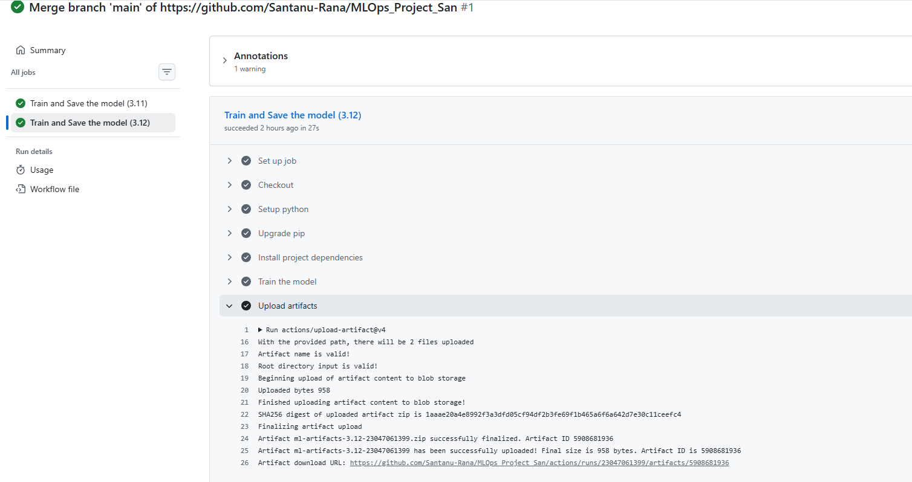

This repository demonstrates a tiny reproducible MLOps flow:

Train a small model (train.py) — writes artifacts/model.pkl and artifacts/metrics.json

Run predictions from the command line with run_model.py --input "[5.1,3.5,1.4,0.2]"
Start a minimal Flask app with python src/app.py that serves /predict
Build a Docker image with docker build -t hello-mlops .
CI trains the model and uploads artifacts

